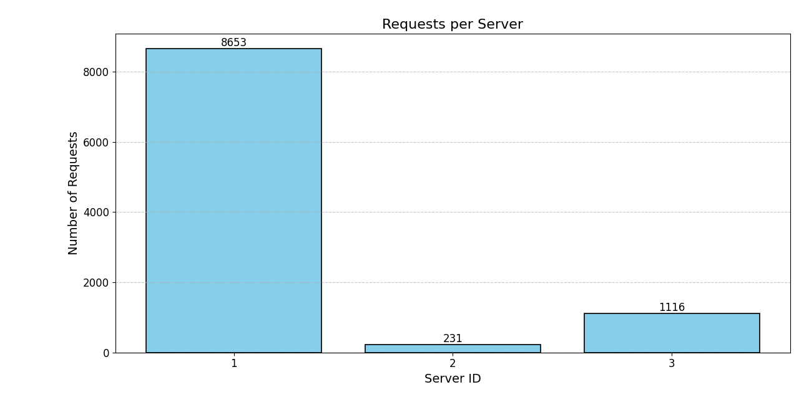
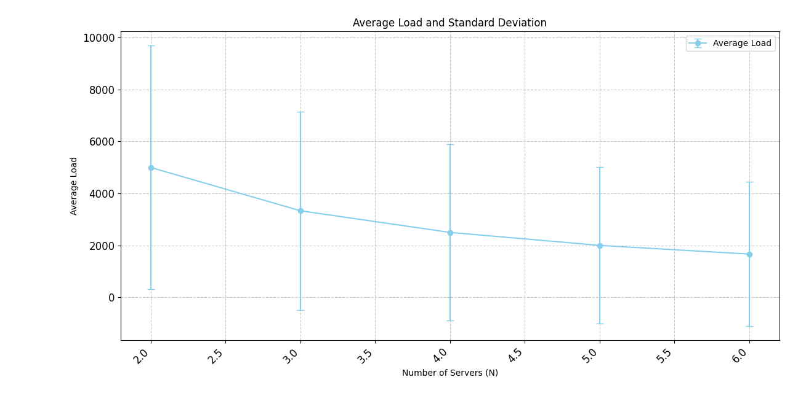
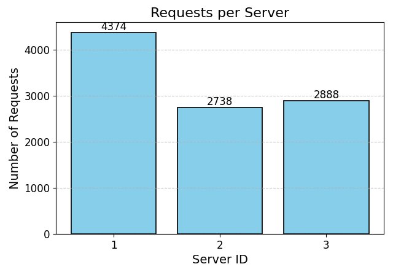
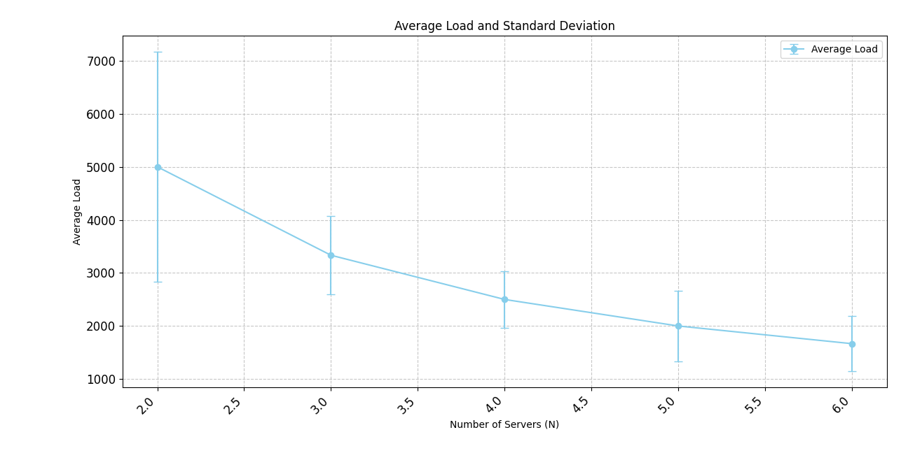

# Assignment 1: Implementing a Customizable Load Balancer

## Group Members:
### Ayush Kumar Dwivedi (20CS10084)
### Saptarshi De Chaudhury (20CS10080)
### Nikumbh Sarthak Sham (20CS30035)

## Prerequisites
Ensure that Docker and Docker Compose are installed on your machine before proceeding.

## Usage
### Cleaning Up

To clean up existing containers and images related to the Load Balancer project, execute the following command:

``` make clean ```

### Running the Setup

To build and deploy all the docker images and containers and get the system up and running, execute the following command:

``` make run ```

This command will automatically clean up existing containers and images and start the application.

## Design Choices

The server and load balancer have been implemented as Flask applications, containerized and deployed using Docker.

### Consistent Hashing Implementation

A class named ConsistentHashing has been defined which contains all the necessary functions related to mapping of request and server using the consistent hashing scheme. 

#### Data Structures used 

`serverList`: It is an array of size **M (512)**, each index storing the name of the server that is mapped to that slot.  
`serverIndices`: Maintains the virtual server indexes of all the servers as a sorted set. It represents the circular structure of the consistent hash map.  
`serverNameToIndex`: This is a dictionary object. For each server, it maintains a list of virtual server indexes that it is mapped to. 

#### Working of Consistent Hashing

Whenever a server is added to the network, its corresponding virtual server indexes are computed and stored in the respective data structures. Quadratic probing is used to ensure that two virtual server indexes do not coincide.  

Now when a request is received, the hash of its request ID is computed. We take the upper bound of the hash from the `serverIndices` sorted set to get the virtual server index that the request will be mapped to, and then the corresponding actual server instance is fetched using the `serverList` array. Finally the allocated server name is returned for further processing.

When a server is removed from the network then the virtual server indexes are cleared from the corresponding data structures.

### Load Balancer Implementation

#### Global Data Structures used 

`server_names`: This is a list of all the currently running servers.
`count`: Stores the number of currently running servers.
`request_queue`: Queue for storing all incoming requests to servers.

Whenever the `/add` or `/rm` endpoints are called then `server_names` and `count` are updated by using locks appropriately. Queue is threadsafe in Python so there is no need to use locks when appending or popping from `request_queue`.

#### Working of the Load Balancer

##### Handling Requests to Server

The load balancer uses a queue to store all the incoming requests to the `/home` endpoint.  

We use multithreading to service the requests, namely we implement 100 worker threads, each of which does the following: 

   **1.** Pop a request from the front of the request queue. Each request object also contains a response field that will be populated.  
   **2.** Use the previously defined consistent hashing class to find out the server that this request will be allocated to.   
   **3.** Make the request to the server and store the response in the request object's response field.

The client that makes the request waits on the response field of the request object.  

We have used multithreading in the load balancer to ensure that the allocation of requests to servers and their handling can be done concurrently.

##### Handling Failure of containers

We define a heartbeat thread in the load balancer that periodically sends requests to the `/heartbeat` endpoint of all the servers in `server_names`.  
The number of responding servers is counted and if it falls short of the minimum number of containers required then a corresponding call is made to the `/add` endpoint to spawn the remaining containers. The `server_names` and `count` variables are updated accordingly.

## Analysis  

### A-1  



As we can see from the bar chart, when N=3, the vast majority of the requests are handled by Server 1. This is due to the hash function for virtual server mapping `Φ(i, j) = i² + j² + 2j + 25`.  

Since i varies from 1 to 3 and j varies from 1 to 9, hence the first slot allocated to a virtual server corresponds to the index `1² + 1² + 2*1 + 25 = 29` (Server 1) and the last slot allocated to a virtual server corresponds to the index `3² + 9² + 2*9 + 25 = 133` (Server 3). As a result, all the requests that get mapped to indexes between 134 and 512 wrap around to the start of the circular hashmap and get allocated to Server 1.  

This can affect the performance of the system since most of the requests are getting handled by Server 1 despite using the consistent hashing scheme. A better hash function can help to distribute the load.

### A-2 



The line chart shows the average load of each server for each iteration from N=2 to N=6. Also the standard deviation of number of requests per server is calculated and plotted.

We observe that the average load for each server decreases as the number of servers is increased. Also the standard deviation decreases, meaning that the load gets more evenly distributed with increase in number of servers. Hence the load balancer implementation is scalable with larger number of servers. Again, a better choice of hash function can improve the load distribution.

### A-3

We have tested all the endpoints of the load balancer including the `/add` and `/rm` endpoints. The heartbeat thread of the load balancer keeps monitoring the server containers and whenever their number falls below N, the heartbeat thread itself calls the `/add` endpoint and spawns new containers quickly to handle the load.

### A-4  

We have used the following hash functions:  

Hash function for Request mapping: `H(i) = i² + 11i + 19`  
Hash function for Server mapping: `Φ(i, j) = 16(i-1) + 57j`

  



After running the tests for A-1 and A-2 using the new hash functions we get the above graphs. We can see that the load has been distributed much more evenly in this case and the standard deviation has also decreased significantly across all N from 2 to 6.
